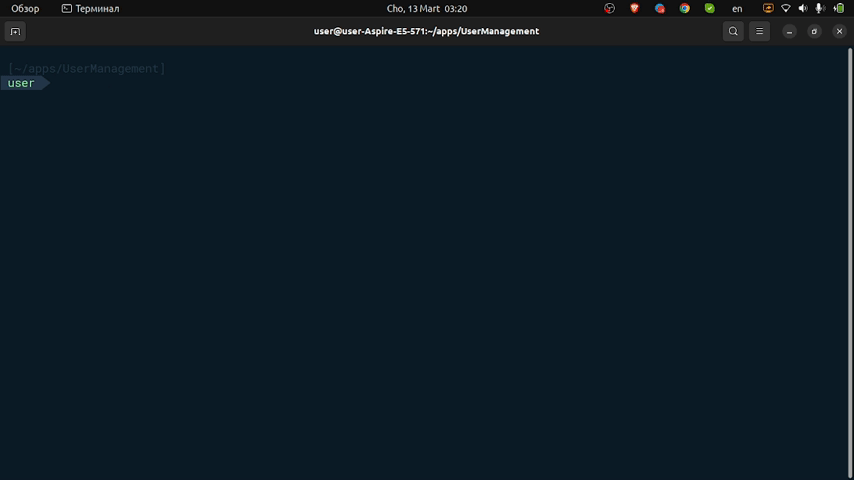

# Bu loyiha foydalanuvchilarni boshqarish uchun konsol dasturi. U quyidagi vazifalarni bajaradi:

## Foydalanuvchi ma'lumotlarini qo'shish:
##### Foydalanuvchi yangi foydalanuvchini qo'shishi mumkin, uning foydalanuvchi nomini (login) va parolini kiritsa. Ushbu ma'lumotlar fayl ma'lumotlarida saqlanadi.

## Autentifikatsiya:
##### Foydalanuvchi tizimga kiring, o'z foydalanuvchi nomi va parolini kiritib turing. Kiritilgan foydalanuvchi ma'lumotlari saqlangan ma'lumotlar bilan taqqoslanadi. Kiritilgan ma'lumotlar saqlangan ma'lumotlar bilan mos keladigan holatda, foydalanuvchi muvaffaqiyatli autentifikatsiya qilinadi.

## Dasturdan chiqish:
##### Foydalanuvchi dasturdan chiqish uchun menyudan mos holatni tanlash orqali dasturni tugatishi mumkin.

## Loyiha bir nechta qismlardan iborat:
##### Konsol dasturi (UserManagment.Console): Bu asosiy dastur, foydalanuvchi bilan terminal orqali muloqot qiladi va talab etilgan amallarni bajarish uchun boshqa komponentlardan tegishli usullarni chaqiradi.

##### Ma'lumotlar saqlash brokeri (UserManagment.Brokers.StorageBroker): Bu qisqaruvchi saqlash va ma'lumotlarni olish bilan shug'ullanadi. Bizning holatimizda, u ma'lumotlarni (foydalanuvchi nomi va parol) matnli faylda saqlaydi.

##### Foydalanuvchi logikasi xizmati (UserManagment.Services.UserService): Bu komponent foydalanuvchilar boshqarish biznes logikasini o'z ichiga oladi. U yangi foydalanuvchilarni qo'shish va tizimga kiringanda ma'lumotlarni tekshirish uchun metodlar taqdim etadi.

##### Ma'lumot modellari (UserManagment.Models.User): #Bu komponent foydalanuvchi uchun ma'lumot modelini aniqlaydi.

##### Dastur SOLID prinsiplarini va mas'uliyatlarini bo'lib bo'lishni amalga oshirish va kodni tashkil etishda ish joylarini ajratish prinsiplarini o'rgatadigan oddiy misolni namoyish etadi.

## Namuna:
